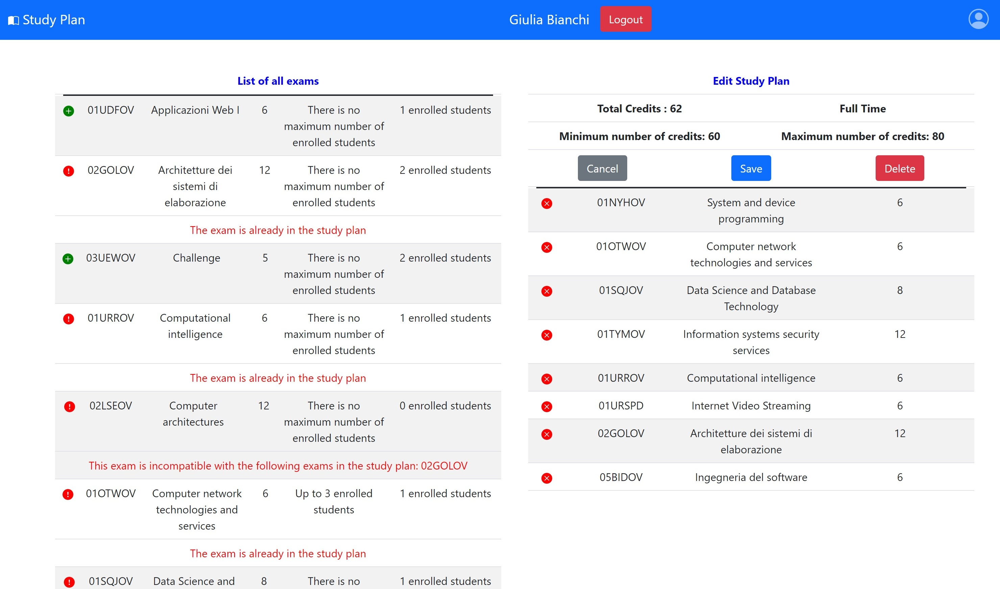

# Exam #1: "StudyPlan"
## Student: s294547 BIANCHI GIULIA 

## React Client Application Routes

- Route `/`: 
    This page shows *ALWAYS* the list of exams and, if some user is currently logged in, also the study plan of the user is shown.
    At first, the study plan is in "view" mode.
    If the user has no study plan, it can be created by clicking of the button "Add a Study Plan", switching to the "add" mode. In this mode, the type of the study plan can be selected, then it is possible to add/remove exams to it and, in the end, to save or cancel the modifications made.
    If the user currently has a study plan, it can be modified by clicking on the button "Edit", switching to the "edit" mode. When modifiyng a study plan, we can add/remove exams to it, it can also be deleted and it is possible to cancel or save the modifications made.
    At the end of the modification or the creation of a study plan, the page turns back to "show" mode.
    If the user is logged in, it is possible to perform logout by clicking on the "Logout" button in the navigation bar, while if the user is not logged in, the login page can be reached by clicking on the "Login" button in the navigation bar.

- Route `/login`: 
    This page shows the form to perform the user login. 
    If something goes wrong with the user login, an error message is shown under the navbar. 
    If the login is correctly performed, the user is redirected to the home page ('/').

- Route `*`: 
    Each other path different from the two specified, takes the user in a page showing an error message. 

## API Server

- **API: `GET /exams`**
\
    `GET /exams`
    Retrieve the list of all the available exams
    - **Request header** has no parameters.
    - **Request body** is empty.
    - **Response**: `200 OK` (success). Return a JSON object, representing the exams stored in the Database. The **response body** has the following structure: 
    ```JSON
    {
        "code": 1,
        "name": "Web Applications 1", 
        "credits": 6,
        "maxStudents": 3,
        "currentStudents": 3,
        "preparatory": null,
        "incompatible": null
    }
    {
        "code": 2,
        "name": "Web Applications 2", 
        "credits": 6,
        "maxStudents": 3,
        "currentStudents": 3,
        "preparatory": null,
        "incompatible": null
    }
    .
    .
    .
    ```
    - **Error responses**: 
        - `422 UNPROCESSABLE ENTITY` (the body of the request is not empty)
        - `500 INTERNAL SERVER ERROR` (generic error if the server crashes) 
---

- **API: `GET /studyplan`**
\
    `GET /studyplan`
    Retrieve a Study Plan, given its student “id” taken from the auth cookie.
    - **Request header** has no parameters.
    - **Request body** is empty.
    - **Response**: `200 OK` (success). Return a JSON object, representing the study plan of a student stored in the Database. The **response body** has the following structure: 
    ```JSON
    {   "type": "Full Time",
        "code": 1,
        "name": "Web Applications 1", 
        "credits": 6,
        "maxStudents": 3,
        "currentStudents": 3,
        "preparatory": null,
        "incompatible": null
    }
    {   "type": "Full Time",
        "code": 2,
        "name": "Web Applications 2", 
        "credits": 6,
        "maxStudents": 3,
        "currentStudents": 3,
        "preparatory": null,
        "incompatible": null
    }
    
    ```
    - **Error responses**: 
        - `422 UNPROCESSABLE ENTITY` (the body of the request is not empty)
        - `500 INTERNAL SERVER ERROR` (generic error if the server crashes) 
---

- **API: `POST /studyplan`**
\
    `POST /studyplan`
    Add a new exam to the study plan of the student with "id" taken from the auth cookie.
    - **Request header** has a line: `Content-Type: application/json`
    - **Request body** is a JSON object containing the exam code. The structure of the body is the following: 
    ```JSON
    {
        "code": "01UDFOV"
    }
    ```
    - **Response**: `201 CREATED` (success).
    - **Error responses**: 
        - `422 UNPROCESSABLE ENTITY` (the request body is not in the specified format)
        - `500 INTERNAL SERVER ERROR` (generic error if the server crashes) 
---

- **API: `PUT /studyplan`**
\
    `PUT /studyplan`
    Update the type of and existing studyplan, by providing the user "id" in the auth cookie.
    - **Request header** has a line: `Content-Type: application/json`.
    - **Request body** is a JSON object containing new type. The structure of the body is the following: 
    ```JSON
    {
        "type": "None"
    }
    ```
    - **Response**: `200 OK` (success).
    - **Error responses**: 
        - `422 UNPROCESSABLE ENTITY` (the request body or the `id` are not in the specified format)
        - `500 INTERNAL SERVER ERROR` (generic error if the server crashes) 
---

- **API: `DELETE /studyplan`**
\
    `DELETE /studyplan`
    Delete an existing studyplan, given its user “id” in the auth cookie.
    - **Request header** is empty.
    - **Request body** is empty.
    - **Response**: `204 NO CONTENT` (success).
    - **Error responses**: 
        - `422 UNPROCESSABLE ENTITY` (the request body or the `id` is not in the specified format)
        - `500 INTERNAL SERVER ERROR` (generic error if the server crashes) 
---

- **API: `PUT /user/sessions`**
\
    `PUT /user/sessions`
    Succesfully login an user
    - **Request header** has a line: `Content-Type: application/json`.
    - **Request body** is a JSON object containing all the user informations. The structure of the body is the following: 
    ```JSON
    {
        "id": 1,
        "username": "giuliabianchi",
        "name": "Giulia",
        "surname": "Bianchi",
        "type": "Full Time"
    }
    ```
    - **Response**: `201` (success). Returns a JSON object containing all the user informations. The structure of the body is the following: 
    ```JSON
    {
        "id": 1,
        "username": "giuliabianchi",
        "name": "Giulia",
        "surname": "Bianchi",
        "type": "Full Time"
    }
    ```
    - **Error responses**: 
        - `401 NOT AUTORIZED` (something went wrong with the login)
---

- **API: `GET /user/sessions/current`**
\
    `GET /user/sessions/current`
    Checks if the user is currently logged in.
    - **Request header** has a line: `Content-Type: application/json`.
    - **Request body** is a JSON object containing all the user informations. The structure of the body is the following: 
    ```JSON
    {
        "id": 1,
        "username": "giuliabianchi",
        "name": "Giulia",
        "surname": "Bianchi",
        "type": "Full Time"
    }
    ```
    - **Response**: `200` (success). Returns a JSON object containing all the user informations. The structure of the body is the following: 
    ```JSON
    {
        "id": 1,
        "username": "giuliabianchi",
        "name": "Giulia",
        "surname": "Bianchi",
        "type": "Full Time"
    }
    ```
    - **Error responses**: 
        - `401 NOT AUTORIZED` 
---

- **API: `DELETE /user/sessions/current`**
\
    `DELETE /user/sessions/current`
    Logs the user out.
    - **Request header** is empty.
    - **Request body** is empty.
    - **Response**: `204` (logged out)
---


## Database Tables

- Table `Student` 
    - **id** : a unique number identifying the student 
    - **name** : the name of the student 
    - **surname** : the surname of the student
    - **password** : hashed password of the student
    - **type** : type of the study plan of the student
    - **username** : username of the student
    - **salt** : salt used to compute the hash of the password of the student

- Table `Exam` 
    - **code** : a string of 7 number or letters identifying the exam 
    - **name** : the name of the exam 
    - **credits** : the number of credits of an exam
    - **maxStudents** : the maximum number of students enrolled to an exam
    - **preparatory** : the code of a preparatory exam, it may be null
    - **incompatible** : codes of incompatible exams separated by the ',' , it may be null 

- Table `StudyPlan` 
    - **code** : a string of 7 number or letters identifying the exam 
    - **id** : a unique number to identify the student
   
## Main React Components

- `HomePage` (in `components/Home.js`): component rendered when the route is *'/'*. Inside this component, other important components of the page are rendered, like the navigation bar, the exam list and the study plan. The home page can be id different modes: "show" when the exams and an eventual study plan are showed, "edit" to edit an existing study plan and "add" to create a new study plan. If the user is not logged id, the mode will always be "show" and just the exam list will be visible. If the user is logged in but he has no study plan, it is possible to switch from "show" mode to "add" mode to add a new study plan. If the user is logged in and he has a study plan, it is possible to switch from "show" mode to "edit" mode to edit the study plan. 

- `LoginPage` (in `components/Home.js`): component rendered when the route is *'/login'*. Inside this component, other important components are rendere, like the login form and an eventual error message when the login fails.

- `NoMatchPage` (in `components/Home.js`): component rendered when the route is different from the two specified. Inside this component is shown a message to explain the user is in a non existing page.

- `NavigationBar` (in `components/NavigationBar.js`): this component creates the navigation bar of the page. In the navbar, there is an icon and a title, by clicking on the icon we can go back to the home page. If the user is logged in, the navbar shows also the user name and surname and a logout button, otherwise it shows a login button, which redirects the user to the login page, when clicked. 

- `ExamList` (in `components/ExamList.js`): this component creates the exam list of the page. An ExamList renders different ExamRows.

- `ExamRow` (in `utilities/ExamRow.js`): this component is one of the exam rows of the exam table. If the selected mode is "show", it is possible to expand the row and to view other informations, like the incompatible exams and the preparatory exam, otherwise just the basic informations (code, name, credits, maximum number of students and currently enrolled students). If the selected mode is "edit" or "add" and if it is possible to add the exam to the study plan, a plus green circle on the left of the row will be showed to fulfill this purpose. If the selected mode is "edit" or "add" and if it is not possible to add the exam to the study plan, the green circle will be replaced by a red one with a warning sign and, in the end of the row, the explanation of why the exam cannot be added will be shown.

- `StudyPlan` (in `components/StudyPlan.js`): this component creates the study plan of the page. A StudyPlan renders different StudyPlanRows. If there is no study plan for a given user, the table contains just a message explaining it and a button to create a new study plan. If there is a study plan for a given user, the table shows at first the total number of credits, the type of the study plan and then all the exams of the study plan and gives the possibility to edit it with an edit button.

- `StudyPlanRow` (in `utilities/StudyPlanRow.js`): this component is one of the study plan rows of the study plan table. The informations displayed are the exam code, the exam name and the number of credits for a given exam. If the selected mode is "edit" or "add", an x in a red circle on the left of the row will be showed to remove the exam from the study plan.

- `LoginForm` (in `components/LoginForm.js`): this component creates the form to perform login. There are two input elements, one for the username and one for the password, and both of the values are controlled by a state variable. To submit the login credentials, there is a "Login" button. We can also go back to the previous page by clicking on the "Back" button.


## Screenshot



## Users Credentials

- **USERNAME**: giuliabianchi, **PASSWORD**: trytoguessmypassword 
- **USERNAME**: mattiagennaro, **PASSWORD**: trytoguessmypassword 
- **USERNAME**: claudiasaitti, **PASSWORD**: trytoguessmypassword 
- **USERNAME**: giorgiobianchi, **PASSWORD**: trytoguessmypassword 
- **USERNAME**: clarissapomo, **PASSWORD**: trytoguessmypassword 
